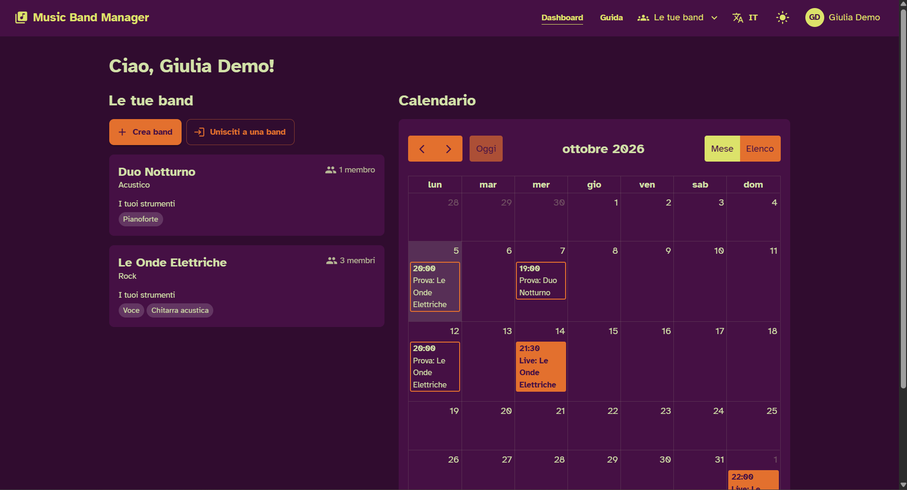
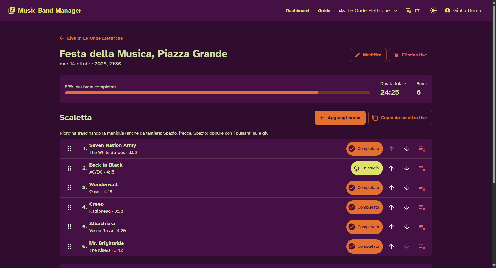
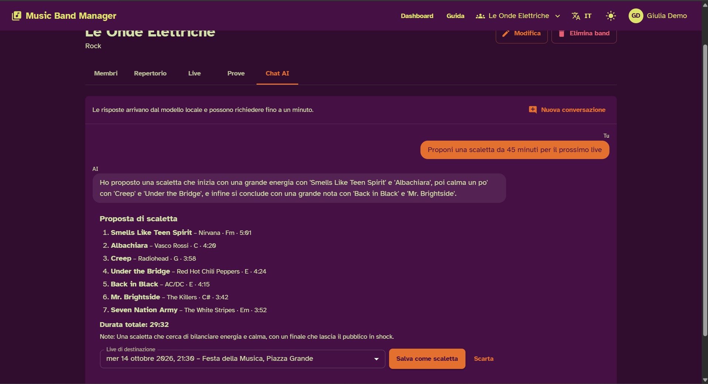
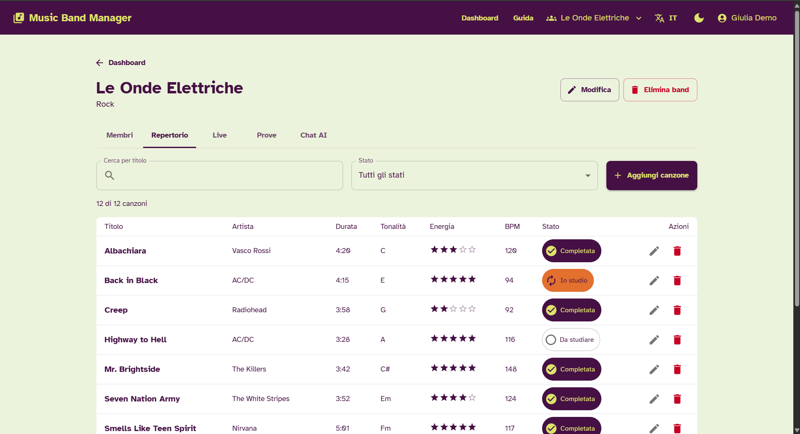
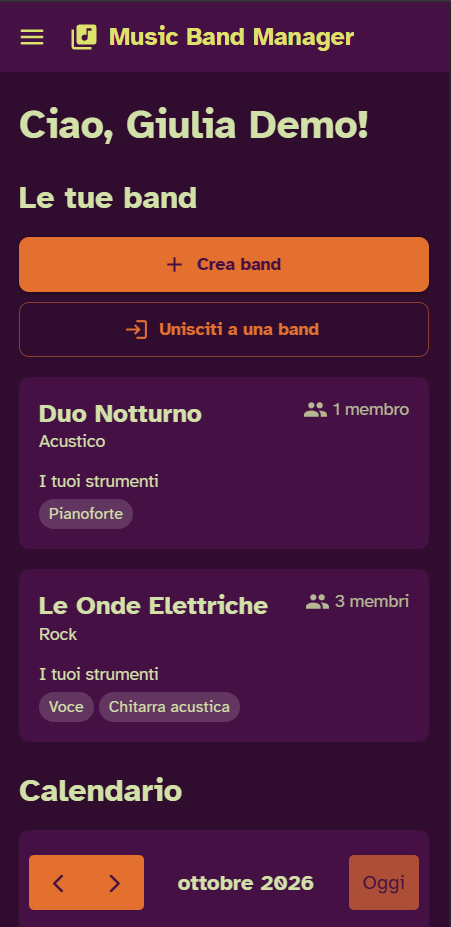
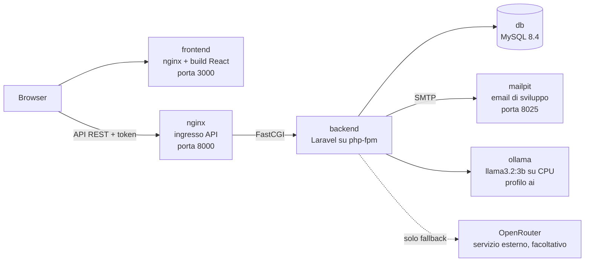

# Music Band Manager

Web app per organizzare una band musicale: membri e strumenti, repertorio con lo stato di preparazione dei brani, prove, live con la loro scaletta e una chat AI locale (Ollama) che risponde sui dati della band e propone scalette.

Frontend React + Material UI, API Laravel, database MySQL, tutto avviato con Docker Compose. Le specifiche complete sono in [`docs/specifiche.md`](docs/specifiche.md).

## Indice

1. [Funzionalità](#funzionalità)
2. [Screenshot](#screenshot)
3. [Architettura e scelte tecniche](#architettura-e-scelte-tecniche)
4. [Prerequisiti](#prerequisiti)
5. [Avvio rapido](#avvio-rapido)
6. [Come provare il sistema](#come-provare-il-sistema)
7. [API, Postman e test](#api-postman-e-test)
8. [Chat AI con Ollama](#chat-ai-con-ollama)
9. [Backend di terze parti: OpenRouter](#backend-di-terze-parti-openrouter)
10. [Struttura del repository](#struttura-del-repository)
11. [Problemi comuni](#problemi-comuni)
12. [Funzionalità future](#funzionalità-future)
13. [Riferimenti](#riferimenti)
14. [Autore](#autore)

## Funzionalità

- **Account**: registrazione, login, password dimenticata con link via email, profilo (nome, email, cambio password, eliminazione dell'account). Nella Navbar e nel profilo c'è un avatar con le iniziali.
- **Band e membri**: creazione di una band, ingresso con un codice di invito, strumenti di ogni membro, rimozione di un membro, uscita ed eliminazione della band. Un utente può stare in più band; la band corrente compare nella Navbar.
- **Repertorio**: canzoni con titolo, artista, versione, link, durata, tonalità, energia (1-5), BPM e note. Ogni brano ha uno stato: da studiare, in studio o completato. Ricerca per titolo, filtro per stato, conteggio e durata totale.
- **Live e scaletta**: per ogni live si costruisce la scaletta con brani del repertorio o nuovi. Il riordino funziona trascinando (anche al tocco e da tastiera) o con i pulsanti su/giù. La scaletta si può copiare da un altro live. Durata totale e percentuale di brani completati arrivano dall'API.
- **Prove**: luogo, data/ora e note.
- **Calendario**: live e prove di tutte le proprie band, in vista mensile o a elenco (su smartphone).
- **Chat AI**: per ogni band, risponde su repertorio, live e prove e propone una scaletta che si salva in un live con un click.
- **Interfaccia**: tema chiaro e scuro, italiano e inglese, pensata anche per smartphone.

## Screenshot

| Dashboard (tema scuro) | Scaletta di un live |
| --- | --- |
|  |  |
| Le band dell'utente e il calendario con live e prove. | Progresso, durata totale e riordino della scaletta. |

| Chat AI | Repertorio (tema chiaro) |
| --- | --- |
|  |  |
| Proposta di scaletta da salvare in un live. | Stati dei brani, ricerca, filtro e durata totale. |



Vista da smartphone (360 px): menu a cassetto e una sola colonna.

## Architettura e scelte tecniche



Il browser carica il frontend e chiama l'API. Solo il backend parla con database, Mailpit, Ollama e, se attivo, OpenRouter.

| Scelta | Motivo | Compromesso |
| --- | --- | --- |
| Monorepo | Vincolo del corso: un solo repository, ogni servizio nella sua cartella, avvio dalla radice con un comando. | Backend e frontend condividono storia e commit. |
| nginx + php-fpm invece di `artisan serve` | La chat su CPU può superare i 60 secondi e servono richieste in parallelo. Timeout FastCGI, php-fpm e `max_execution_time` sono a 180 secondi. | Un container in più. Se si ricostruisce solo il backend, nginx risponde 502 finché non si esegue `docker compose restart nginx`. |
| MySQL 8.4 | Database richiesto dalle specifiche; dati nel volume `db_data`. | I test girano su SQLite in memoria (per non toccare i dati di sviluppo), quindi non provano differenze specifiche di MySQL. |
| Laravel Sanctum con token Bearer | API stateless, senza sessioni né cookie; lo stesso token funziona dal frontend e da Postman. | Il frontend salva il token nel `localStorage` e i token non hanno scadenza (`expiration` nullo). |
| React + Material UI + Vite | Stack del progetto. MUI dà tema chiaro/scuro (`createTheme`), dialog, tabelle e date picker. | La build segnala un bundle sopra i 500 kB, soprattutto per MUI; l'avviso è accettato. |
| dnd-kit per la scaletta | Riordino con mouse, tocco (maniglia di 44 px) e tastiera, con annunci per lettori di schermo; in più i pulsanti su/giù. | Lo spostamento del brano trascinato è scritto a mano (solo verticale). |
| FullCalendar | Vista mensile a griglia e vista a elenco (`listMonth`) per smartphone. | Gli stili si adattano al tema con variabili CSS e qualche regola che sovrascrive quelle di FullCalendar. |
| react-i18next | Testi in `it.json` ed `en.json`. Ogni richiesta invia `Accept-Language`, così anche validazione ed email di reset sono nella lingua scelta. | Ogni testo va scritto in due file. |
| Font Atkinson Hyperlegible | Pensato per la leggibilità; arriva dal pacchetto npm `@fontsource`, quindi nessuna richiesta a Google Fonts e funziona anche offline. | Un solo font con due pesi (400 e 700). |
| Durata e progresso calcolati dal backend | Non si salvano: si calcolano a ogni richiesta con una query aggregata (`withCount` e `withSum`), quindi non vanno fuori sincrono. Il frontend mostra i valori ricevuti. | Ogni modifica alla scaletta rilegge il live. Eccezione: la durata totale del repertorio la somma il browser, che ha già tutti i brani. |
| Password dimenticata con Mailpit | Password Broker di Laravel; il link porta al frontend e scade dopo 60 minuti; dopo il reset tutti i token vengono revocati. In sviluppo Mailpit intercetta le email. | Nessuna email reale: in produzione servirebbe un server SMTP vero. |
| Band eliminata quando esce l'ultimo membro | Non restano band senza membri (vale anche se un utente elimina l'account). | Tutti i membri hanno gli stessi permessi, compresi eliminare la band e rimuovere altri membri. |
| Codice di invito con limite di tentativi | 8 caratteri senza simboli ambigui (niente 0/O, 1/I); l'ingresso è limitato a 10 tentativi al minuto per utente. | Login, password dimenticata e reset non hanno limite di tentativi. |

Dettagli e decisioni prese durante lo sviluppo: [`docs/specifiche.md`](docs/specifiche.md).

## Prerequisiti

- **Docker con Compose v2** (comando `docker compose`). Su Windows e macOS: Docker Desktop. Su Linux: Docker Engine con il plugin Compose.
- **Con Ollama**: circa 4 GB di spazio libero (il modello pesa circa 2 GB) e 8 GB di RAM consigliati.
- **Senza Ollama**: servono molte meno risorse (vedi [Avvio senza Ollama](#avvio-senza-ollama)).
- **Git**. Il file [`.gitattributes`](.gitattributes) forza gli a capo LF su script e file di configurazione: con gli a capo CRLF di Windows gli script non funzionerebbero dentro i container.

Node e PHP non servono sul computer: tutto gira nei container.

## Avvio rapido

### Primo avvio

```bash
git clone <url-del-repository>
cd MusicBand-Manager
cp .env.example .env
docker compose up --build
```

`.env` è l'unico file locale necessario e non si versiona. I valori di `.env.example` funzionano così come sono.

Cosa succede al primo avvio:

1. Vengono costruite le immagini di backend e frontend e scaricate quelle di MySQL, nginx, Mailpit e Ollama.
2. Il backend aspetta che MySQL sia pronto, genera una chiave dell'applicazione se `APP_KEY` è vuota ed esegue le migrazioni.
3. Con `SEED_ON_START=true`, e solo se non ci sono utenti, crea i dati dimostrativi.
4. Il servizio `ollama-pull` scarica il modello `llama3.2:3b` (circa 2 GB) e poi termina. Il tempo dipende dalla connessione. L'app si può usare subito; la chat risponde a download finito.

Come capire che è pronto:

- <http://localhost:8000/up> risponde con la pagina di stato di Laravel: l'API è attiva.
- <http://localhost:3000> mostra la pagina di login.
- Per la chat: `docker compose logs ollama-pull` termina con `Modello llama3.2:3b pronto.`; `docker compose exec ollama ollama list` elenca il modello.

### Avvio senza Ollama

Su un PC con poca RAM, nel `.env` lascia vuoto il profilo e avvia normalmente:

```dotenv
COMPOSE_PROFILES=
```

`ollama` e `ollama-pull` non partono e non si scarica nulla. La chat risponde "AI non disponibile" e il resto dell'app funziona.

### Servizi, indirizzi e porte

| Servizio | Indirizzo | Variabile nel `.env` | Note |
| --- | --- | --- | --- |
| `frontend` | <http://localhost:3000> | `FRONTEND_PORT` | Applicazione web |
| `nginx` | <http://localhost:8000/api> | `API_PORT` | API REST; stato su `/up` |
| `backend` | nessuna porta sull'host | | Laravel su php-fpm, raggiungibile tramite nginx |
| `db` | `localhost:3307` | `DB_HOST_PORT` | MySQL; utente, password e database in `DB_USERNAME`, `DB_PASSWORD`, `DB_DATABASE` |
| `mailpit` | <http://localhost:8025> | `MAILPIT_PORT` | Interfaccia web delle email inviate dall'app |
| `ollama` | `127.0.0.1:11434` | | Solo con `COMPOSE_PROFILES=ai`, raggiungibile solo dal computer locale |
| `ollama-pull` | nessuna | | Scarica il modello e termina |

Per usare l'app servono `frontend`, `nginx`, `backend` e `db`. `mailpit` serve per il reset della password, `ollama` per la chat.

### Account demo

| Email | Password | Band |
| --- | --- | --- |
| `demo1@example.com` | `password123` | Giulia Demo: "Le Onde Elettriche" e "Duo Notturno" |
| `demo2@example.com` | `password123` | Marco Demo: "Le Onde Elettriche" |

I dati comprendono 15 canzoni (12 della prima band e 3 della seconda), due live di "Le Onde Elettriche" (uno con una scaletta di 6 brani) e tre prove. Le date sono calcolate a partire dal giorno del seed. Per ripristinarli:

```bash
docker compose exec backend php artisan migrate:fresh --seed
```

### Fermare tutto

```bash
docker compose down      # ferma e rimuove i container; database e modello restano nei volumi
docker compose down -v   # come sopra, ma cancella anche i volumi: database e modello scaricato
```

Dopo `down -v` il prossimo avvio ricrea il database con i dati demo e riscarica il modello.

## Come provare il sistema

1. **Accedi** su <http://localhost:3000> con `demo1@example.com` / `password123`. La dashboard mostra le due band e il calendario.
2. **Apri la band** "Le Onde Elettriche": nel tab Membri ci sono il codice di invito e gli strumenti di ogni membro.
3. **Guarda il repertorio** (tab Repertorio): cambia lo stato di un brano cliccando sul suo badge, prova ricerca e filtro e osserva conteggio e durata totale.
4. **Costruisci una scaletta**: nel tab Live apri "Festa della Musica, Piazza Grande", aggiungi un brano, riordina trascinando o con i pulsanti su/giù e osserva progresso e durata totale aggiornarsi.
5. **Calendario**: torna alla dashboard e apri un live o una prova dal calendario.
6. **Chat AI** (con Ollama attivo): nel tab Chat AI chiedi, ad esempio, una scaletta per il prossimo live e salvala dalla card della proposta.
7. **Reset della password**: esci, scegli "Password dimenticata" e inserisci `demo2@example.com`. Apri <http://localhost:8025>, leggi l'email e segui il link per impostare una nuova password. Per tornare a `password123` ripristina i dati demo con `migrate:fresh --seed`.

## API, Postman e test

- **Documentazione**: [`docs/API.md`](docs/API.md) contiene esempi reali di richiesta e risposta per ogni endpoint. Base URL: `http://localhost:8000/api`.
- **Collection Postman**: in Postman scegli **Import** e seleziona i due file in [`docs/postman/`](docs/postman/), cioè `rehearsal-setlist-manager.postman_collection.json` e `local.postman_environment.json`. Poi attiva l'environment "Music Band Manager - locale".
- **Ordine**: esegui la collection dall'inizio, ad esempio con il **Collection Runner**. La prima richiesta registra un utente nuovo con un'email sempre diversa. Gli script salvano da soli token e id nell'environment, e il token viene inviato come Bearer da tutte le richieste protette. Le ultime richieste eliminano gli account creati.
- **Da terminale**, con Node installato:

  ```bash
  npx newman run docs/postman/rehearsal-setlist-manager.postman_collection.json -e docs/postman/local.postman_environment.json
  ```

- Se cambi `API_PORT`, aggiorna `baseUrl` nell'environment.
- La richiesta della chat accetta sia 200 sia 503, così la collection passa anche senza Ollama.

**Test del backend** (feature test PHPUnit su SQLite in memoria, non toccano il database di sviluppo):

```bash
docker compose exec backend php artisan test
```

**Controlli del frontend** (con Node installato sul computer):

```bash
npm --prefix frontend ci
npm --prefix frontend run lint
npm --prefix frontend run build
```

## Chat AI con Ollama

**Cosa fa.** La chat di ogni band risponde a domande su repertorio, live e prove e, se richiesto, propone una scaletta. La proposta compare in una card con brani, durata reale e note, e si salva in un live futuro con un click.

**Come funziona.**

1. Il frontend invia a `POST /api/bands/{band}/chat` gli ultimi messaggi della conversazione.
2. `BandContextBuilder` prepara un contesto compatto: band, membri con i soli nomi e strumenti (mai l'email), repertorio (massimo 100 brani), prossimi live con durata e percentuale già calcolate, prossime prove.
3. `AiChatService` chiede al modello una risposta in JSON secondo uno schema. Gli id dei brani ammessi sono un `enum` con i soli id del repertorio.
4. `OllamaClient` chiama l'API `/api/chat` di Ollama, senza streaming.
5. Il backend valida la risposta: scarta gli id non validi e i doppioni e calcola lui la durata totale della proposta. Se la risposta non è JSON, la mostra come testo senza proposta.

**Perché Ollama in locale.** Nessun costo, nessuna chiave da gestire, e i dati della band restano sulla macchina. Il compromesso: un modello piccolo, solo su CPU, risponde lentamente (su CPU anche decine di secondi) ed è meno preciso.

**Modello.** Il predefinito è `llama3.2:3b` (`OLLAMA_MODEL` in `.env.example`). Per cambiarlo modifica `OLLAMA_MODEL` nel `.env` e riavvia con `docker compose up -d`: `ollama-pull` scarica il nuovo modello. Se le risposte sono troppo lente, `llama3.2:1b` è più leggero. `OLLAMA_NUM_THREAD=4` limita i thread della CPU: sulle CPU con core P ed E usarli tutti rende il modello molto più lento. Le altre variabili (`OLLAMA_NUM_CTX`, `OLLAMA_KEEP_ALIVE`, `OLLAMA_TIMEOUT`) sono in `.env.example` e descritte in [`docs/specifiche.md`](docs/specifiche.md).

**Limiti.** I modelli piccoli sbagliano facilmente i calcoli e i confronti su molti brani, per esempio nel sommare le durate. Per questo i dati calcolabili li calcola il backend: durata e progresso dei live nel contesto, durata reale della proposta. La durata della proposta può comunque scostarsi da quella chiesta, perché la scelta dei brani resta del modello.

**Altri modelli provati.** Ho provato anche `llama3.1:8b` e `qwen3.5:4b`. Con entrambi lo schema JSON funzionava, ma sul mio PC con sola CPU erano più lenti e non ho potuto confrontare la qualità con rigore, quindi il predefinito resta il modello leggero.

**Senza Ollama** (profilo non attivo, modello non ancora scaricato o nessuna risposta entro `OLLAMA_TIMEOUT` secondi) la chat risponde 503 "AI non disponibile" e il resto dell'app funziona. Il limite è di 10 richieste al minuto per utente; oltre si riceve 429 e il frontend mostra "Troppe richieste".

## Backend di terze parti: OpenRouter

[OpenRouter](https://openrouter.ai) è un servizio esterno che dà accesso a vari modelli tramite un'API compatibile con quella di OpenAI. Nel progetto è un **fallback facoltativo, spento di default**.

**Come si attiva.** Crea una chiave gratuita su <https://openrouter.ai> e imposta nel `.env`:

```dotenv
AI_FALLBACK_ENABLED=true
OPENROUTER_API_KEY=la-tua-chiave
# facoltativo: modello da usare (default openrouter/free)
OPENROUTER_MODEL=openrouter/free
```

Poi riavvia il backend con `docker compose up -d`.

**Come avviene il collegamento.** La chiamata la fa solo il backend Laravel (`OpenRouterClient`) verso `https://openrouter.ai/api/v1/chat/completions`, con la chiave nell'header `Authorization: Bearer`. Il frontend non parla mai con OpenRouter e la chiave non esce dal server: sta nel `.env`, che non si versiona. Si usa lo stesso schema JSON di Ollama (`response_format` di tipo `json_schema`), con un timeout di 45 secondi.

**Quando scatta.** Solo se Ollama non risponde: servizio irraggiungibile, errore (ad esempio modello non scaricato) o timeout. Se Ollama risponde, OpenRouter non viene chiamato.

**In caso di errore.** Con la chiave mancante il fallback viene saltato. Se OpenRouter risponde con un errore, ad esempio 429 quando si supera il limite delle richieste gratuite, la chat risponde 503 "AI non disponibile", come senza Ollama. L'errore resta nei log del backend (`docker compose logs backend`).

## Struttura del repository

```text
.
├── backend/                 API Laravel
│   ├── app/                 controller, Form Request, Policy, Resource, modelli
│   │   └── Services/Ai/     chat AI: AiChatService, BandContextBuilder, OllamaClient, OpenRouterClient
│   ├── config/ai.php        configurazione di Ollama e OpenRouter
│   ├── database/            migrazioni e seeder dimostrativo
│   ├── docker/              entrypoint, php.ini e configurazione di php-fpm
│   ├── lang/                messaggi in italiano e inglese
│   ├── routes/api.php       rotte dell'API
│   └── tests/Feature/       feature test
├── frontend/                React + Material UI (Vite)
│   ├── src/
│   │   ├── api/             client axios e funzioni per risorsa
│   │   ├── components/      componenti riutilizzabili
│   │   ├── context/         autenticazione, tema, lingua, notifiche
│   │   ├── hooks/           lettura dei dati dall'API
│   │   ├── locales/         it.json ed en.json
│   │   ├── pages/           pagine dell'app
│   │   └── theme/           tema MUI e palette
│   └── nginx.conf           server dei file statici
├── docker/
│   ├── nginx/default.conf   ingresso dell'API verso php-fpm
│   └── ollama/pull.sh       download del modello
├── docs/
│   ├── specifiche.md        specifiche complete
│   ├── piano-di-lavoro.md   fasi di sviluppo
│   ├── API.md               esempi di richiesta e risposta
│   ├── postman/             collection ed environment
│   └── screenshots/         immagini usate in questo README
├── docker-compose.yml
├── .env.example             da copiare in .env
└── .gitattributes           a capo LF
```

## Problemi comuni

**Porta già occupata.** Cambia la porta nel `.env` (`FRONTEND_PORT`, `API_PORT`, `DB_HOST_PORT`, `MAILPIT_PORT`). Se cambi `API_PORT`, aggiorna anche `APP_URL` e `VITE_API_URL`. Se cambi `FRONTEND_PORT`, aggiorna `FRONTEND_URL`: serve al CORS e ai link nelle email. Poi riavvia con `docker compose up --build`, perché l'indirizzo dell'API è fissato nella build del frontend. La porta 11434 di Ollama non è configurabile: se Ollama è già installato e attivo sul computer, fermalo prima di avviare il profilo `ai`.

**La chat risponde "AI non disponibile" (503).**
- Controlla che nel `.env` ci sia `COMPOSE_PROFILES=ai`.
- Controlla che il download sia finito: `docker compose logs ollama-pull`, `docker compose exec ollama ollama list`.
- Leggi la causa nei log: `docker compose logs backend`. Ad esempio, un 404 di Ollama indica un modello non scaricato; un timeout indica che il modello è troppo lento per il PC.
- Se il modello è troppo lento, prova `OLLAMA_MODEL=llama3.2:1b`.

**Memoria insufficiente.** Con Ollama attivo servono circa 8 GB di RAM. Su Windows e macOS controlla la memoria assegnata a Docker Desktop. In alternativa usa `llama3.2:1b` o avvia senza Ollama (`COMPOSE_PROFILES=`).

**Errori del database dopo un aggiornamento del codice, o live demo non più visibili.** Le migrazioni partono a ogni avvio, ma se lo schema non è più allineato, o se le date demo sono ormai passate (i tab Live e Prove mostrano solo eventi futuri), ricrea il database con i dati dimostrativi:

```bash
docker compose exec backend php artisan migrate:fresh --seed
```

Attenzione: cancella tutti i dati.

**Errore 502 dopo aver ricostruito solo il backend.** Esegui `docker compose restart nginx`.

**L'email di reset non arriva.** Le email non escono dal computer: si leggono in Mailpit su <http://localhost:8025>. La richiesta risponde sempre con successo, ma l'email parte solo se l'indirizzo è registrato. Il link vale 60 minuti e porta all'indirizzo di `FRONTEND_URL`.

**Il backend non parte su Windows, con errori negli script che contengono `\r`.** Gli script hanno a capo CRLF. Il file `.gitattributes` forza LF, quindi basta una clone nuova del repository. Evita di copiare i file da archivi o editor che convertono gli a capo.

## Funzionalità future

- **Accessibilità.** Oggi ci sono contrasti verificati (almeno 4.5:1), riordino della scaletta da tastiera, il font Atkinson Hyperlegible, etichette tradotte e annunci per lettori di schermo nella chat e nelle notifiche. Il passo successivo è un audit con lettore di schermo (NVDA, VoiceOver) e test automatici con axe o Lighthouse, perché finora i controlli sono stati manuali. Mancano anche un link "vai al contenuto", utile a chi naviga da tastiera, e una revisione completa degli annunci dinamici.
- **Autenticazione.**
  - Verifica dell'indirizzo email alla registrazione: oggi qualsiasi indirizzo viene accettato.
  - Autenticazione a due fattori.
  - Scadenza dei token: oggi non scadono.
  - Elenco dei dispositivi collegati, con revoca dei singoli accessi: oggi gli altri token si revocano solo cambiando password.
  - Limite di tentativi anche su login e password dimenticata: oggi c'è solo su ingresso in band e chat.
- **Foto profilo** con caricamento di un file: oggi l'avatar mostra solo le iniziali.
- **Chat AI.**
  - Note di transizione tra un brano e l'altro.
  - Tonalità compatibili calcolate dal backend, come già succede per le durate.
  - Suggerimento di brani nuovi con un modello più capace: uno piccolo tende a inventare titoli.
  - Supporto GPU e modelli più grandi come opzione.
  - Contatore giornaliero delle richieste a OpenRouter, per restare nei limiti gratuiti.
- **Scaletta in PDF** o stampa pensata per il palco, da leggere durante il live.
- **Test end-to-end del frontend e integrazione continua** (GitHub Actions): oggi il frontend si controlla solo con lint e build, e i test del backend si lanciano a mano.
- **Hot reload in sviluppo** con un `docker-compose.dev.yml`: oggi ogni modifica al frontend richiede una nuova build dell'immagine.
- **Notifiche o promemoria** per prove e live in arrivo.

## Riferimenti

- Laravel: <https://laravel.com/docs>
- Laravel Sanctum: <https://laravel.com/docs/sanctum>
- Ollama: <https://ollama.com> e <https://github.com/ollama/ollama>
- OpenRouter: <https://openrouter.ai/docs>
- Material UI: <https://mui.com/material-ui/>
- React: <https://react.dev>
- Vite: <https://vite.dev>
- FullCalendar: <https://fullcalendar.io/docs/react>
- dnd-kit: <https://github.com/clauderic/dnd-kit>
- react-i18next: <https://react.i18next.com>
- Atkinson Hyperlegible: <https://fontsource.org/fonts/atkinson-hyperlegible>
- Mailpit: <https://mailpit.axllent.org>
- Docker Compose: <https://docs.docker.com/compose/>
- Postman: <https://learning.postman.com>

## Autore

[NOME], progetto finale del corso Fullstack ITS FS25.
